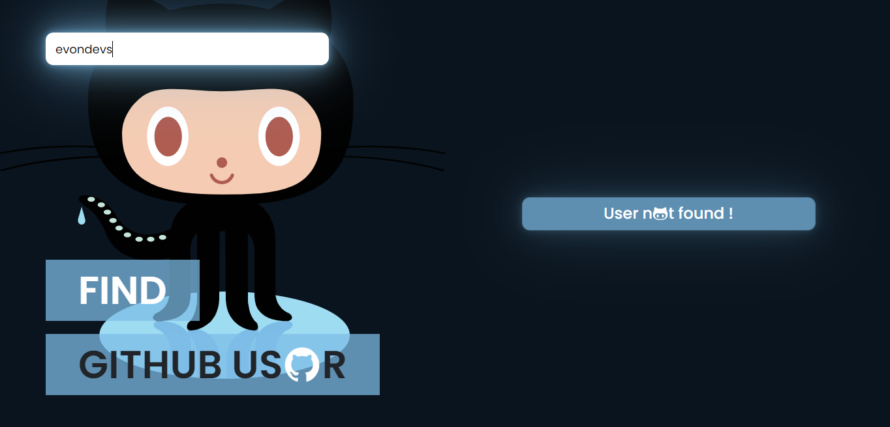

# Find Github User
## Deploy
>https://happy-clarke-a49f78.netlify.app/
## Endpoint
- Ex: https://api.github.com/users/PrimeRogue
>https://api.github.com/users/${username}

## Get Repositories
- Ex: https://api.github.com/users/PrimeRogue/repos?sort=created
>https://api.github.com/users/${username}/repos?sort=created

## Demo

